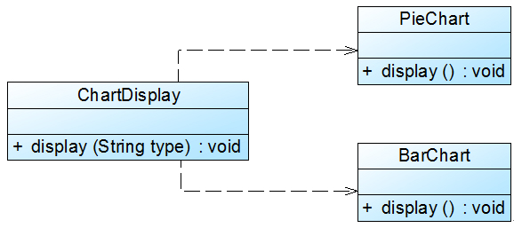

# 面向对象设计原则之开闭原则

开闭原则是面向对象的可复用设计的第一块基石，它是最重要的面向对象设计原则。开闭原则由 Bertrand  Meyer 于 1988 年提出，其定义如下：

> 开闭原则 \(Open-Closed Principle, OCP\)：一个软件实体应当对扩展开放，对修改关闭。即软件实体应尽量在不修改原有代码的情况下进行扩展。

在开闭原则的定义中，**软件实体可以指一个软件模块、一个由多个类组成的局部结构或一个独立的类**。

任何软件都需要面临一个很重要的问题，即它们的需求会随时间的推移而发生变化。当软件系统需要面对新的需求时，我们应该尽量保证系统的设计框架是稳定的。如果一个软件设计符合开闭原则，那么可以非常方便地对系统进行扩展，而且在扩展时无须修改现有代码，使得软件系统在拥有适应性和灵活性的同时具备较好的稳定性和延续性。随着软件规模越来越大，软件寿命越来越长，软件维护成本越来越高，设计满足开闭原则的软件系统也变得越来越重要。

为了满足开闭原则，需要对系统进行抽象化设计，抽象化是开闭原则的关键。在 Java、C\# 等编程语言中，可以为系统定义一个相对稳定的抽象层，而将不同的实现行为移至具体的实现层中完成。在很多面向对象编程语言中都提供了接口、抽象类等机制，可以通过它们定义系统的抽象层，再通过具体类来进行扩展。如果需要修改系统的行为，无须对抽象层进行任何改动，只需要增加新的具体类来实现新的业务功能即可，实现在不修改已有代码的基础上扩展系统的功能，达到开闭原则的要求。

Sunny 软件公司开发的 CRM 系统可以显示各种类型的图表，如饼状图和柱状图等，为了支持多种图表显示方式，原始设计方案如图1所示：



在 `ChartDisplay` 类的 `display()` 方法中存在如下代码片段：

```text
if (type.equals("pie")) {
    PieChart chart = new PieChart();
    chart.display();
}
else if (type.equals("bar")) {
    BarChart chart = new BarChart();
    chart.display();
}
......
```

在该代码中，如果需要增加一个新的图表类，如折线图 `LineChart`，则需要修改 `ChartDisplay` 类的 `display()` 方法的源代码，增加新的判断逻辑，违反了开闭原则。

在本实例中，由于在 `ChartDisplay` 类的 `display()` 方法中针对每一个图表类编程，因此增加新的图表类不得不修改源代码。可以通过抽象化的方式对系统进行重构，使之增加新的图表类时无须修改源代码，满足开闭原则。具体做法如下：

1. 增加一个抽象图表类 `AbstractChart` ，将各种具体图表类作为其子类；
2. `ChartDisplay` 类针对抽象图表类进行编程，由客户端来决定使用哪种具体图表。

重构后结构如图 2 所示：


在图 2 中，我们引入了抽象图表类 `AbstractChart`，且 `ChartDisplay` 针对抽象图表类进行编程，并通过 `setChart()` 方法由客户端来设置实例化的具体图表对象，在 `ChartDisplay` 的 `display()` 方法中调用 `chart` 对象的 `display()` 方法显示图表。如果需要增加一种新的图表，如折线图 `LineChart`，只需要将 `LineChart` 也作为 `AbstractChart` 的子类，在客户端向 `ChartDisplay` 中注入一个 `LineChart` 对象即可，无须修改现有类库的源代码。

注意：因为 xml 和 properties 等格式的配置文件是纯文本文件，可以直接通过 VI 编辑器或记事本进行编辑，且无须编译，因此在软件开发中，一般不把对配置文件的修改认为是对系统源代码的修改。如果一个系统在扩展时只涉及到修改配置文件，而原有的 Java 代码或 C\# 代码没有做任何修改，该系统即可认为是一个符合开闭原则的系统。


 【作者：刘伟  [http://blog.csdn.net/lovelion](http://blog.csdn.net/lovelion)】

