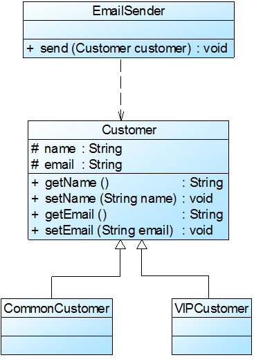
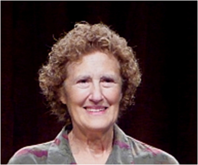

# 面向对象设计原则之里氏代换原则

里氏代换原则由 2008 年图灵奖得主、美国第一位计算机科学女博士 Barbara Liskov 教授和卡内基·梅隆大学 Jeannette Wing 教授于 1994 年提出。其严格表述如下：如果对每一个类型为 S 的对象 o1，都有类型为 T 的对象 o2，使得以 T 定义的所有程序 P 在所有的对象 o1 代换 o2 时，程序 P 的行为没有变化，那么类型 S 是类型 T 的子类型。这个定义比较拗口且难以理解，因此我们一般使用它的另一个通俗版定义：

> 里氏代换原则 \(Liskov Substitution Principle, LSP\)：所有引用基类（父类）的地方必须能透明地使用其子类的对象。

里氏代换原则告诉我们，**在软件中将一个基类对象替换成它的子类对象，程序将不会产生任何错误和异常，反过来则不成立，如果一个软件实体使用的是一个子类对象的话，那么它不一定能够使用基类对象**。例如：我喜欢动物，那我一定喜欢狗，因为狗是动物的子类；但是我喜欢狗，不能据此断定我喜欢动物，因为我并不喜欢老鼠，虽然它也是动物。

例如有两个类，一个类为 `BaseClass`，另一个是 `SubClass` 类，并且 `SubClass` 类是 `BaseClass` 类的子类，那么一个方法如果可以接受一个 `BaseClass` 类型的基类对象 `base` 的话，如：`method1(base)`，那么它必然可以接受一个 `BaseClass` 类型的子类对象 `sub`，`method1(sub)` 能够正常运行。反过来的代换不成立，如一个方法 `method2` 接受 `BaseClass` 类型的子类对象 `sub` 为参数：`method2(sub)`，那么一般而言不可以有 `method2(base)`，除非是重载方法。

里氏代换原则是实现开闭原则的重要方式之一，由于使用基类对象的地方都可以使用子类对象，因此**在程序中尽量使用基类类型来对对象进行定义，而在运行时再确定其子类类型，用子类对象来替换父类对象**。

在使用里氏代换原则时需要注意如下几个问题：

1. 子类的所有方法必须在父类中声明，或子类必须实现父类中声明的所有方法。根据里氏代换原则，为了保证系统的扩展性，在程序中通常使用父类来进行定义，如果一个方法只存在子类中，在父类中不提供相应的声明，则无法在以父类定义的对象中使用该方法。
2. 我们在运用里氏代换原则时，尽量把父类设计为抽象类或者接口，让子类继承父类或实现父接口，并实现在父类中声明的方法，运行时，子类实例替换父类实例，我们可以很方便地扩展系统的功能，同时无须修改原有子类的代码，增加新的功能可以通过增加一个新的子类来实现。里氏代换原则是开闭原则的具体实现手段之一。
3. Java 语言中，在编译阶段，Java 编译器会检查一个程序是否符合里氏代换原则，这是一个与实现无关的、纯语法意义上的检查，但 Java 编译器的检查是有局限的。

在 Sunny 软件公司开发的CRM系统中，客户 \(Customer\) 可以分为VIP客户 \(VIPCustomer\) 和普通客户 \(CommonCustomer\) 两类，系统需要提供一个发送 Email 的功能，原始设计方案如图 1 所示：

在对系统进行进一步分析后发现，无论是普通客户还是 VIP 客户，发送邮件的过程都是相同的，也就是说两个 `send()` 方法中的代码重复，而且在本系统中还将增加新类型的客户。为了让系统具有更好的扩展性，同时减少代码重复，使用里氏代换原则对其进行重构。

在本实例中，可以考虑增加一个新的抽象客户类 `Customer`，而将 `CommonCustomer` 和 `VIPCustomer` 类作为其子类，邮件发送类EmailSender类针对抽象客户类Customer编程，根据里氏代换原则，能够接受基类对象的地方必然能够接受子类对象，因此将 `EmailSender` 中的 `send()` 方法的参数类型改为 `Customer`，如果需要增加新类型的客户，只需将其作为 `Customer` 类的子类即可。重构后的结构如图2所示：

**里氏代换原则是实现开闭原则的重要方式之一。**在本实例中，在传递参数时使用基类对象，除此以外，在定义成员变量、定义局部变量、确定方法返回类型时都可使用里氏代换原则。针对基类编程，在程序运行时再确定具体子类。

扩展：里氏代换原则以 Barbara Liskov（芭芭拉·利斯科夫）教授的姓氏命名。芭芭拉·利斯科夫：美国计算机科学家，2008年图灵奖得主，2004年约翰·冯诺依曼奖得主，美国工程院院士，美国艺术与科学院院士，美国计算机协会会士，麻省理工学院电子电气与计算机科学系教授，美国第一位计算机科学女博士。

【作者：刘伟  [http://blog.csdn.net/lovelion](http://blog.csdn.net/lovelion)】

