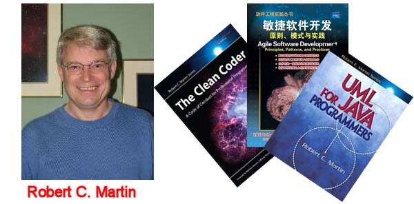

# 面向对象设计原则之依赖倒转原则

如果说开闭原则是面向对象设计的目标的话，那么依赖倒转原则就是面向对象设计的主要实现机制之一，它是系统抽象化的具体实现。依赖倒转原则是 Robert C. Martin 在 1996 年为 _C++ Reporter_ 所写的专栏 _Engineering Notebook_ 的第三篇，后来加入到他在 2002 年出版的经典著作 _Agile Software Development, Principles, Patterns, and Practices_ 一书中。依赖倒转原则定义如下：

> 依赖倒转原则 \(Dependency Inversion  Principle, DIP\)：抽象不应该依赖于细节，细节应当依赖于抽象。换言之，要针对接口编程，而不是针对实现编程。

依赖倒转原则要求我们在程序代码中传递参数时或在关联关系中，尽量引用层次高的抽象层类，即使用接口和抽象类进行变量类型声明、参数类型声明、方法返回类型声明，以及数据类型的转换等，而不要用具体类来做这些事情。为了确保该原则的应用，一个具体类应当只实现接口或抽象类中声明过的方法，而不要给出多余的方法，否则将无法调用到在子类中增加的新方法。

在引入抽象层后，系统将具有很好的灵活性，在程序中尽量使用抽象层进行编程，而将具体类写在配置文件中，这样一来，如果系统行为发生变化，只需要对抽象层进行扩展，并修改配置文件，而无须修改原有系统的源代码，在不修改的情况下来扩展系统的功能，满足开闭原则的要求。

在实现依赖倒转原则时，我们需要针对抽象层编程，而将具体类的对象通过依赖注入 ****\(DependencyInjection, DI\) 的方式注入到其他对象中，依赖注入是指当一个对象要与其他对象发生依赖关系时，通过抽象来注入所依赖的对象。常用的注入方式有三种，分别是：构造注入，设值注入（Setter 注入）和接口注入。构造注入是指通过构造函数来传入具体类的对象，设值注入是指通过 Setter 方法来传入具体类的对象，而接口注入是指通过在接口中声明的业务方法来传入具体类的对象。这些方法在定义时使用的是抽象类型，在运行时再传入具体类型的对象，由子类对象来覆盖父类对象。

扩展：软件工程大师 Martin Fowler 在其文章 _Inversion of Control Containers and the Dependency Injection pattern_ 中对依赖注入进行了深入的分析，参考链接：[http://martinfowler.com/articles/injection.html](http://martinfowler.com/articles/injection.html)

下面通过一个简单实例来加深对依赖倒转原则的理解：

Sunny 软件公司开发人员在开发某 CRM 系统时发现：该系统经常需要将存储在 TXT 或 Excel 文件中的客户信息转存到数据库中，因此需要进行数据格式转换。在客户数据操作类中将调用数据格式转换类的方法实现格式转换和数据库插入操作，初始设计方案结构如图 1 所示：

在编码实现图 1 所示结构时，Sunny 软件公司开发人员发现该设计方案存在一个非常严重的问题，由于每次转换数据时数据来源不一定相同，因此需要更换数据转换类，如有时候需要将 `TXTDataConvertor` 改为 `ExcelDataConvertor` ，此时，需要修改 `CustomerDAO` 的源代码，而且在引入并使用新的数据转换类时也不得不修改 `CustomerDAO` 的源代码，系统扩展性较差，违反了开闭原则，现需要对该方案进行重构。

在本实例中，由于 `CustomerDAO` 针对具体数据转换类编程，因此在增加新的数据转换类或者更换数据转换类时都不得不修改 `CustomerDAO` 的源代码。我们可以通过引入抽象数据转换类解决该问题，在引入抽象数据转换类 `DataConvertor` 之后， `CustomerDAO` 针对抽象类 `DataConvertor` 编程，而将具体数据转换类名存储在配置文件中，符合依赖倒转原则。根据里氏代换原则，程序运行时，具体数据转换类对象将替换 `DataConvertor` 类型的对象，程序不会出现任何问题。更换具体数据转换类时无须修改源代码，只需要修改配置文件；如果需要增加新的具体数据转换类，只要将新增数据转换类作为 `DataConvertor` 的子类并修改配置文件即可，原有代码无须做任何修改，满足开闭原则。重构后的结构如图 2 所示：

在上述重构过程中，我们使用了开闭原则、里氏代换原则和依赖倒转原则，在大多数情况下，这三个设计原则会同时出现，**开闭原则是目标，里氏代换原则是基础，依赖倒转原则是手段**，它们相辅相成，相互补充，目标一致，只是分析问题时所站角度不同而已。

扩展：Robert C. Martin（Bob大叔）：Object Mentor 公司总裁，面向对象设计、模式、UML、敏捷方法学和极限编程领域内的资深顾问。

 再上两张 Bob 大叔的“玉照”，😁：

【作者：刘伟  [http://blog.csdn.net/lovelion](http://blog.csdn.net/lovelion)】

