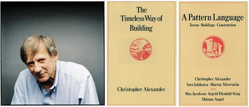
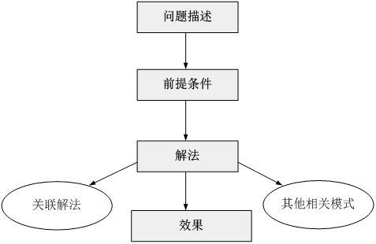
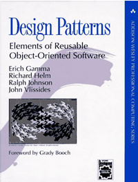

# 设计模式从何而来

在介绍设计模式的起源之前，我们先要了解一下模式的诞生与发展。与很多软件工程技术一样，模式起源于建筑领域，毕竟与只有几十年历史的软件工程相比，已经拥有几千年沉淀的建筑工程有太多值得学习和借鉴的地方。

那么模式是如何诞生的？让我们先来认识一个人——Christopher Alexander（克里斯托弗.亚历山大），哈佛大学建筑学博士、美国加州大学伯克利分校建筑学教授、加州大学伯克利分校环境结构研究所所长、美国艺术和科学院院士……头衔真多，🙂，不过他还有一个“昵称”——模式之父 \(The father of patterns\)。Christopher Alexander 博士及其研究团队用了约20年的时间，对住宅和周边环境进行了大量的调查研究和资料收集工作，发现人们对舒适住宅和城市环境存在一些共同的认同规律，Christopher Alexander 在著作 _A Pattern Language: Towns, Buildings, Construction_ 中把这些认同规律归纳为 253 个模式，对每一个模式 \(Pattern\) 都从 Context（前提条件）、Theme 或 Problem（目标问题）、 Solution（解决方案）三个方面进行了描述，并给出了从用户需求分析到建筑环境结构设计直至经典实例的过程模型。

在 Christopher Alexander 的另一部经典著作《建筑的永恒之道》中，他给出了关于模式的定义：

> 每个模式都描述了一个在我们的环境中不断出现的问题，然后描述了该问题的解决方案的核心，通过这种方式，我们可以无数次地重用那些已有的成功的解决方案，无须再重复相同的工作。

这个定义可以简单地用一句话表示：

> **模式是在特定环境下人们解决某类重复出现问题的一套成功或有效的解决方案。**
>
> **A pattern is a successful or efficient solution to a recurring  problem within a context.**

1990年，软件工程界开始关注 ChristopherAlexander 等在这一住宅、公共建筑与城市规划领域的重大突破。最早将模式的思想引入软件工程方法学的是 1991 - 1992 年以“四人组 （Gang of Four，简称 GoF，分别是 Erich Gamma, Richard Helm, Ralph Johnson 和 John Vlissides）”自称的四位著名软件工程学者，他们在 1994 年归纳发表了 23 种在软件开发中使用频率较高的设计模式，旨在用模式来统一沟通面向对象方法在分析、设计和实现间的鸿沟。

GoF 将模式的概念引入软件工程领域，这标志着软件模式的诞生。软件模式 \(Software Patterns\) 是将模式的一般概念应用于软件开发领域，即软件开发的总体指导思路或参照样板。软件模式并非仅限于设计模式，还包括架构模式、分析模式和过程模式等，实际上，在软件开发生命周期的每一个阶段都存在着一些被认同的模式。

软件模式是在软件开发中某些可重现问题的一些有效解决方法，软件模式的基础结构主要由四部分构成，包括问题描述【待解决的问题是什么】、前提条件【在何种环境或约束条件下使用】、解法【如何解决】和效果【有哪些优缺点】，如图 1 - 1 所示：

软件模式与具体的应用领域无关，也就是说无论你从事的是移动应用开发、桌面应用开发、Web应用开发还是嵌入式软件的开发，都可以使用软件模式。

在软件模式中，设计模式是研究最为深入的分支，设计模式用于在特定的条件下为一些重复出现的软件设计问题提供合理的、有效的解决方案，它融合了众多专家的设计经验，已经在成千上万的软件中得以应用。 1995 年， GoF 将收集和整理好的23种设计模式汇编成 _Design Patterns: Elements of Reusable Object-Oriented Software_ （《设计模式：可复用面向对象软件的基础》）一书，该书的出版也标志着设计模式正式成为面向对象 \(Object Oriented\) 软件工程的一个重要研究分支。

从1995年至今，无论是在大型API或框架（如 JDK、.net Framework 等）、轻量级框架（如 Struts、Spring、 Hibernate、JUnit 等）、还是应用软件的开发中，设计模式都得到了广泛的应用。如果你正在从事面向对象开发或正准备从事面向对象开发，无论你是使用 Java、C\#、Objective-C、VB.net、Smalltalk 等纯面向对象编程语言，还是使用 C++、PHP、Delphi、JavaScript 等可支持面向对象编程的语言，如果你一点设计模式也不懂，我可以毫不夸张的说：你真的 out 了。

【作者：刘伟 [http://blog.csdn.net/lovelion](http://blog.csdn.net/lovelion)】

