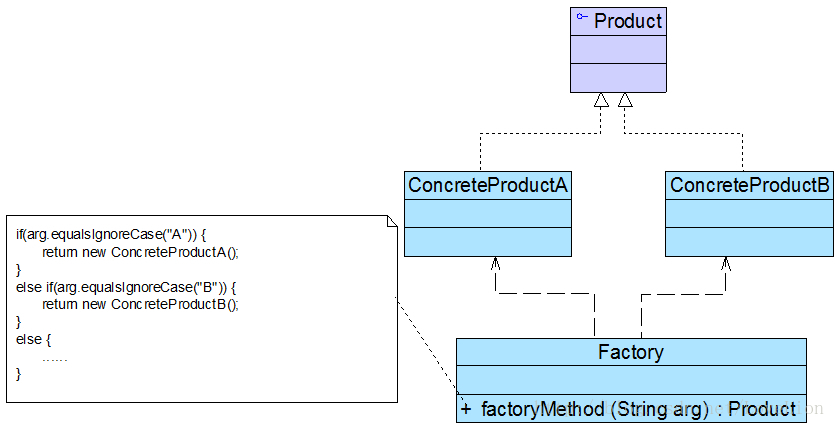
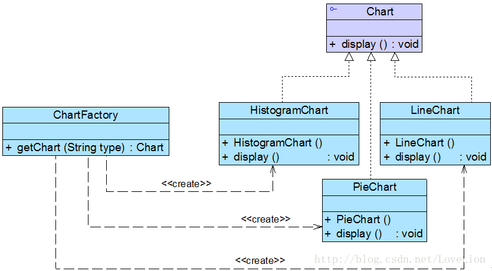

# 工厂三兄弟之简单工厂模式

## 1. 图表库的设计

Sunny 软件公司欲基于 Java 语言开发一套图表库，该图表库可以为应用系统提供各种不同外观的图表，例如柱状图、饼状图、折线图等。Sunny 软件公司图表库设计人员希望为应用系统开发人员提供一套灵活易用的图表库，而且可以较为方便地对图表库进行扩展，以便能够在将来增加一些新类型的图表。

Sunny 软件公司图表库设计人员提出了一个初始设计方案，将所有图表的实现代码封装在一个 `Chart` 类中，其框架代码如下所示：

```text
class Chart {
	private String type; //图表类型
	
	public Chart(Object[][] data, String type) {
		this.type = type;
		if (type.equalsIgnoreCase("histogram")) {
			//初始化柱状图
		}
		else if (type.equalsIgnoreCase("pie")) {
			//初始化饼状图
		}
		else if (type.equalsIgnoreCase("line")) {
			//初始化折线图
		}
	}
 
	public void display() {
		if (this.type.equalsIgnoreCase("histogram")) {
			//显示柱状图
		}
		else if (this.type.equalsIgnoreCase("pie")) {
			//显示饼状图
		}
		else if (this.type.equalsIgnoreCase("line")) {
			//显示折线图
		}	
	}
}
```

客户端代码通过调用 `Chart` 类的构造函数来创建图表对象，根据参数 `type` 的不同可以得到不同类型的图表，然后再调用 `display()` 方法来显示相应的图表。

不难看出，`Chart` 类是一个“巨大的”类，在该类的设计中存在如下几个问题：

1. 在 `Chart` 类中包含很多 “if…else…” 代码块，整个类的代码相当冗长，代码越长，阅读难度、维护难度和测试难度也越大；而且大量条件语句的存在还将影响系统的性能，程序在执行过程中需要做大量的条件判断。
2. `Chart` 类的职责过重，它负责初始化和显示所有的图表对象，将各种图表对象的初始化代码和显示代码集中在一个类中实现，违反了“单一职责原则”，不利于类的重用和维护；而且将大量的对象初始化代码都写在构造函数中将导致构造函数非常庞大，对象在创建时需要进行条件判断，降低了对象创建的效率。
3. 当需要增加新类型的图表时，必须修改 `Chart` 类的源代码，违反了“开闭原则”。
4. 客户端只能通过 `new` 关键字来直接创建 `Chart` 对象，`Chart` 类与客户端类耦合度较高，对象的创建和使用无法分离。
5. 客户端在创建 `Chart` 对象之前可能还需要进行大量初始化设置，例如设置柱状图的颜色、高度等，如果在 `Chart` 类的构造函数中没有提供一个默认设置，那就只能由客户端来完成初始设置，这些代码在每次创建 `Chart` 对象时都会出现，导致代码的重复。

面对一个如此巨大、职责如此重，且与客户端代码耦合度非常高的类，我们应该怎么办？本章将要介绍的简单工厂模式**将在一定程度上解决上述问题**。

为什么要引入工厂类，大家可参见：[创建对象与使用对象——谈谈工厂的作用](http://blog.csdn.net/lovelion/article/details/7523392)。

## 2. 简单工厂模式概述

简单工厂模式并不属于 GoF 23 个经典设计模式，但通常将它作为学习其他工厂模式的基础，它的设计思想很简单，其基本流程如下：

首先将需要创建的各种不同对象（例如各种不同的 `Chart` 对象）的相关代码封装到不同的类中，这些类称为**具体产品类**，而将它们公共的代码进行抽象和提取后封装在一个**抽象产品类**中，每一个具体产品类都是抽象产品类的子类；然后提供一个**工厂类**用于创建各种产品，在工厂类中提供一个创建产品的工厂方法，该方法可以根据所传入的参数不同创建不同的具体产品对象；客户端只需调用工厂类的工厂方法并传入相应的参数即可得到一个产品对象。

简单工厂模式定义如下：

> 简单工厂模式 \(Simple Factory Pattern\)：定义一个工厂类，它可以根据参数的不同返回不同类的实例，被创建的实例通常都具有共同的父类。因为在简单工厂模式中用于创建实例的方法是静态 \(static\) 方法，因此简单工厂模式又被称为静态工厂方法 \(Static Factory Method\) 模式，它属于类创建型模式。

简单工厂模式的要点在于：**当你需要什么，只需要传入一个正确的参数，就可以获取你所需要的对象，而无须知道其创建细节。**简单工厂模式结构比较简单，其核心是工厂类的设计，其结构如图 1 所示：



在简单工厂模式结构图中包含如下几个角色：

* **Factory（工厂角色）**：工厂角色即工厂类，它是简单工厂模式的核心，负责实现创建所有产品实例的内部逻辑；工厂类可以被外界直接调用，创建所需的产品对象；在工厂类中提供了静态的工厂方法 `factoryMethod()`，它的返回类型为抽象产品类型 `Product`。
* **Product（抽象产品角色）**：它是工厂类所创建的所有对象的父类，封装了各种产品对象的公有方法，它的引入将提高系统的灵活性，使得在工厂类中只需定义一个通用的工厂方法，因为所有创建的具体产品对象都是其子类对象。
* **ConcreteProduct（具体产品角色）**：它是简单工厂模式的创建目标，所有被创建的对象都充当这个角色的某个具体类的实例。每一个具体产品角色都继承了抽象产品角色，需要实现在抽象产品中声明的抽象方法。

在简单工厂模式中，客户端通过工厂类来创建一个产品类的实例，而无须直接使用 **new** 关键字来创建对象，它是工厂模式家族中最简单的一员。

 在使用简单工厂模式时，首先需要对产品类进行重构，**不能设计一个包罗万象的产品类，而需根据实际情况设计一个产品层次结构**，将所有产品类公共的代码移至抽象产品类，并在抽象产品类中声明一些抽象方法，以供不同的具体产品类来实现，典型的抽象产品类代码如下所示：

```text
abstract class Product {
    //所有产品类的公共业务方法
    public void methodSame() {
        //公共方法的实现
    }
 
    //声明抽象业务方法
    public abstract void methodDiff();
}
```

在具体产品类中实现了抽象产品类中声明的抽象业务方法，不同的具体产品类可以提供不同的实现，典型的具体产品类代码如下所示：

```text
class ConcreteProduct extends Product {
    //实现业务方法
    public void methodDiff() {
        //业务方法的实现
    }
}
```

简单工厂模式的核心是工厂类，在没有工厂类之前，客户端一般会使用 `new` 关键字来直接创建产品对象，而在引入工厂类之后，客户端可以通过工厂类来创建产品，在简单工厂模式中，工厂类提供了一个静态工厂方法供客户端使用，根据所传入的参数不同可以创建不同的产品对象，典型的工厂类代码如下所示：

```text
class Factory {
    //静态工厂方法
    public static Product getProduct(String arg) {
        Product product = null;
        if (arg.equalsIgnoreCase("A")) {
            product = new ConcreteProductA();
            //初始化设置product
        }
        else if (arg.equalsIgnoreCase("B")) {
            product = new ConcreteProductB();
            //初始化设置product
        }
		    return product;
    }
}
```

在客户端代码中，我们通过调用工厂类的工厂方法即可得到产品对象，典型代码如下所示：

```text
class Client {
    public static void main(String args[]) {
        Product product; 
        product = Factory.getProduct("A"); //通过工厂类创建产品对象
        product.methodSame();
        product.methodDiff();
    }
}
```

## 3. 完整解决方案

为了将 `Chart` 类的职责分离，同时将 `Chart` 对象的创建和使用分离，Sunny 软件公司开发人员决定使用简单工厂模式对图表库进行重构，重构后的结构如图 2 所示：



在图 2 中，`Chart` 接口充当抽象产品类，其子类 `HistogramChart`、`PieChart` 和`LineChart` 充当具体产品类，`ChartFactory` 充当工厂类。完整代码如下所示：

```text
//抽象图表接口：抽象产品类
interface Chart {
    public void display();
}
 
//柱状图类：具体产品类
class HistogramChart implements Chart {
    public HistogramChart() {
        System.out.println("创建柱状图！");
    }
	
    public void display() {
        System.out.println("显示柱状图！");
    }
}
 
//饼状图类：具体产品类
class PieChart implements Chart {
    public PieChart() {
        System.out.println("创建饼状图！");
    }
	
    public void display() {
        System.out.println("显示饼状图！");
    }
}
 
//折线图类：具体产品类
class LineChart implements Chart {
    public LineChart() {
        System.out.println("创建折线图！");
    }
	
    public void display() {
        System.out.println("显示折线图！");
    }
}
 
//图表工厂类：工厂类
class ChartFactory {
    //静态工厂方法
    public static Chart getChart(String type) {
        Chart chart = null;
        if (type.equalsIgnoreCase("histogram")) {
            chart = new HistogramChart();
            System.out.println("初始化设置柱状图！");
        }
        else if (type.equalsIgnoreCase("pie")) {
            chart = new PieChart();
            System.out.println("初始化设置饼状图！");
        }
        else if (type.equalsIgnoreCase("line")) {
            chart = new LineChart();
            System.out.println("初始化设置折线图！");			
        }
        return chart;
    }
}
```

编写如下客户端测试代码：

```text
class Client {
    public static void main(String args[]) {
        Chart chart;
        chart = ChartFactory.getChart("histogram"); 
        //通过静态工厂方法创建产品
        chart.display();
    }
}
```

编译并运行程序，输出结果如下：

```text
创建柱状图！
初始化设置柱状图！
显示柱状图！
```

在客户端测试类中，我们使用工厂类的静态工厂方法创建产品对象，如果需要更换产品，只需修改静态工厂方法中的参数即可，例如将柱状图改为饼状图，只需将代码：

`chart = ChartFactory.getChart("histogram");`

 改为：

 `chart = ChartFactory.getChart("pie");`

编译并运行程序，输出结果如下：

```text
创建饼状图！
初始化设置饼状图！
显示饼状图！
```


【作者：刘伟 [http://blog.csdn.net/lovelion](http://blog.csdn.net/lovelion)】

